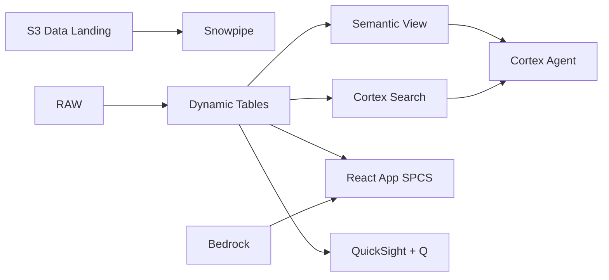

# ESG & Carbon Emissions Monitoring

Track Scope 1/2/3 emissions across Malaysia's O&G operations — AI_PARSE_DOCUMENT extracts ESG report data, Dynamic Tables compute carbon intensity, and Iceberg export enables regulator access.

## Architecture

Malaysia committed to net-zero by 2050, and BURSA Malaysia now mandates sustainability reporting for all listed companies. A major O&G operator with 30 facilities struggles to consolidate emissions data from disparate sources — PDF reports, utility bills, operational meters — while demonstrating auditable reduction progress to regulators.



## Snowflake Capabilities

| Capability | Implementation |
|-----------|---------------|
| Dynamic Tables | FACILITY_EMISSIONS_SUMMARY / EMISSIONS_TIMESERIES / SCOPE2_CALCULATION / REDUCTION_PROGRESS |
| ML Functions |  |
| Cortex AI | AI_PARSE_DOCUMENT, AI_EXTRACT, SUMMARIZE |
| Cortex Search | 100 documents indexed |
| Cortex Agent | ESG_INTELLIGENCE_AGENT |
| Semantic View | ESG_ANALYTICS |
| React App (SPCS) | 5 tabs + DemoGuide |


## AWS Services

| Service | Role in Demo |
|---------|-------------|
| Amazon S3 | Store ESG reports (PDF/DOCX), utility bills, and regulatory submissions |
| Amazon Textract | OCR extraction of emissions data from scanned utility bills and reports |
| Amazon Bedrock (Claude) | Generate ESG narrative summaries and board presentation content |
| Apache Iceberg (S3) | Open table format for regulator and auditor access to emissions data |
| AWS Glue | Catalog and ETL for emissions data consolidation |
| Amazon Athena | Ad-hoc regulator queries on Iceberg emissions tables |
| Amazon QuickSight + Q | ESG dashboard with natural language for sustainability team |


## Personas

| Persona | Role | Key Questions |
|---------|------|---------------|
| **Puan Fatimah binti Othman** | Chief Sustainability Officer | "Are we on track for 2030 reduction targets?" "What's our current BURSA ESG score?" |
| **Dr. Chen Wei** | ESG Analyst | "Show me the Scope 1 breakdown by facility" "What data did AI extract from the Q3 sustainability report?" |


## Data

| Table | Rows | Description |
|-------|------|-------------|
| EMISSION_RECORDS | 50,000 | Monthly Scope 1/2/3 emissions by facility and source category |
| FACILITIES | 30 | O&G facilities — refineries, gas plants, terminals, offshore platforms |
| ESG_REPORTS | 100 | Sustainability reports, TCFD disclosures, CDP submissions (PDF/DOCX) |
| UTILITY_BILLS | 12,000 | Monthly electricity, gas, and water consumption by facility (Scope 2 input) |
| REGULATORY_SUBMISSIONS | 200 | BURSA Malaysia, MyCarbon, MGTC submissions and compliance records |
| CLIMATE_BENCHMARKS | 20 | Industry carbon intensity benchmarks and Malaysia's NDC targets |


## Build Instructions

### Prerequisites
- Snowflake account with ACCOUNTADMIN access
- Cortex AI enabled (ML Functions, Search, Agent)
- Warehouse: OG_ESG_WH (Medium)
- AWS CLI with access (us-west-2)

### Deployment

```bash
snowsql -f snowflake/00_setup.sql
snowsql -f snowflake/01_marketplace_install.sql
snowsql -f snowflake/02_raw_tables.sql
snowsql -f snowflake/03_staging.sql
snowsql -f snowflake/04_dynamic_tables.sql
snowsql -f snowflake/05_search.sql
snowsql -f snowflake/06_ml_models.sql
snowsql -f snowflake/07_semantic_view.sql
snowsql -f snowflake/08_agent.sql
```

### React App (SPCS)
```bash
cd app && npm ci && npm run build
docker build -t aws-malaysia-oil-gas-esg-app .
docker push bdiqc8sm-default.registry.snowflakecomputing.com/oil_gas_esg/app/aws_malaysia_oil_gas_esg/app:latest
```

### Demo Mode
Open the app URL with `?demo=true` for presenter view.

## Build Modes

### Snowflake Only
Run scripts 00-08 (skip AWS-specific integration). Uses:
- **Snowflake Stages + External Volume** instead of Amazon S3
- **AI_PARSE_DOCUMENT + AI_EXTRACT** instead of Amazon Textract
- **Cortex Complete** instead of Amazon Bedrock (Claude)
- **Iceberg Tables (native)** instead of Apache Iceberg (S3)
- **Dynamic Tables + Snowflake Catalog** instead of AWS Glue
- **Snowflake Secure Sharing / Reader Accounts** instead of Amazon Athena
- **Snowflake Intelligence (Cortex Analyst)** instead of Amazon QuickSight + Q

### Full AWS + Snowflake
Run all scripts including AWS integration. Deploy QuickSight dashboard from `quicksight/`.

## Business Impact

Industry research and Snowflake customer outcomes:
- **Malaysia committed to reduce carbon intensity of GDP by 45% by 2030 (vs 2005) under its updated NDC** — [UNFCCC](https://unfccc.int/NDCREG)
- **BURSA Malaysia mandates enhanced sustainability reporting for all Main Market listed issuers from 2024** — [BURSA Malaysia](https://www.bursamalaysia.com/regulation/sustainability)
- **PETRONAS targets net-zero carbon emissions by 2050 with 25% reduction by 2030** — [PETRONAS](https://www.petronas.com/sustainability/net-zero-carbon-emissions)
- **Automated ESG data extraction reduces reporting time by 60-80% and improves accuracy** — [EY Climate Change](https://www.ey.com/en_gl/sustainability)
- **Uniper** (Snowflake customer): built a unified upstream data platform on Snowflake for real-time drilling optimization across 1,000+ wells -- [snowflake.com/customers/uniper](https://www.snowflake.com/en/customers/all-customers/case-study/uniper/)

## Key Demo Numbers

- **2.4M tonnes CO2e** annual emissions across 30 facilities (Scope 1+2+3)
- **30 facilities** tracked — refineries, gas plants, terminals, platforms
- **12% reduction** from 2020 baseline (target: 25% by 2030)
- **100 ESG docs** parsed by AI_PARSE_DOCUMENT
- **BURSA ESG score: B+** up from B — improved data quality and disclosure
- **12,000 utility bills** processed by AI_EXTRACT for Scope 2 calculation
- **200 regulatory submissions** to BURSA, MyCarbon, and MGTC


## License

Apache 2.0 — See [LICENSE](LICENSE) for details.

This is a personal demo project and is not an official Snowflake offering. It comes with no support or warranty.